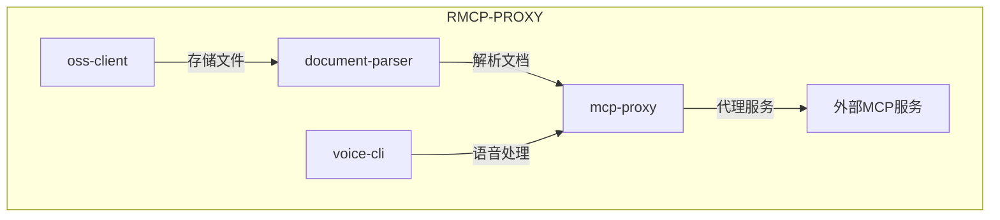
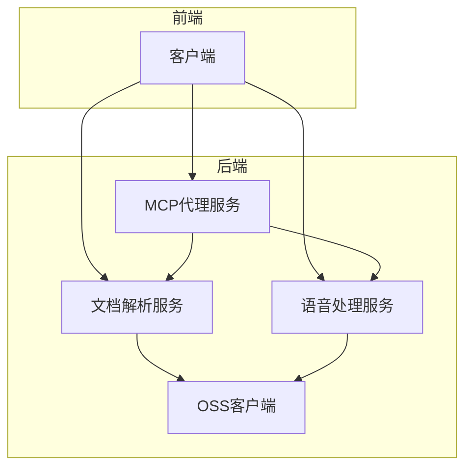
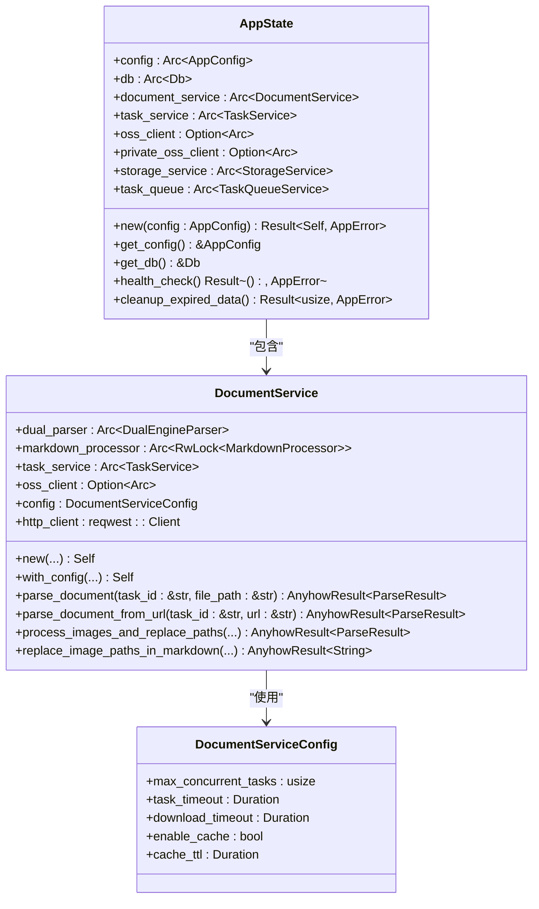
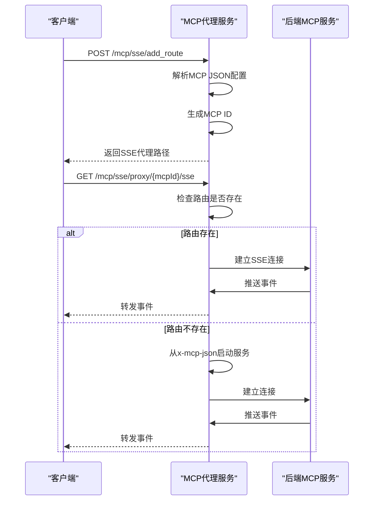
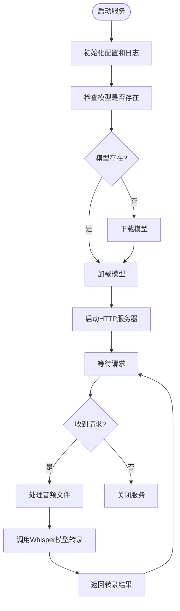
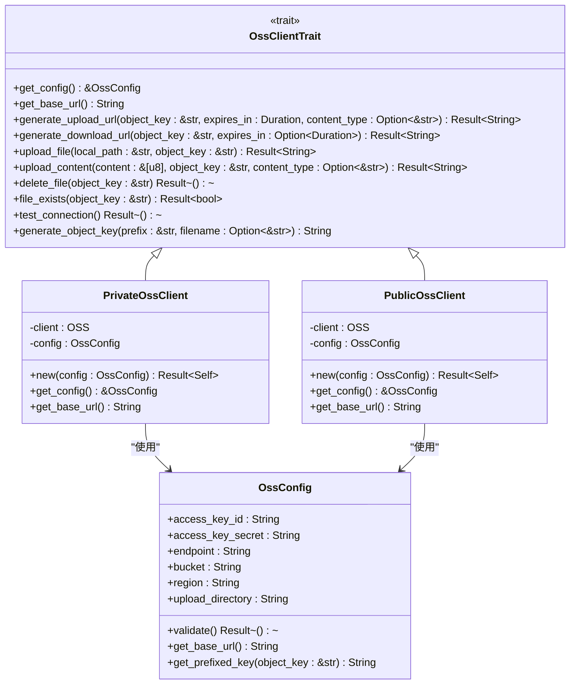
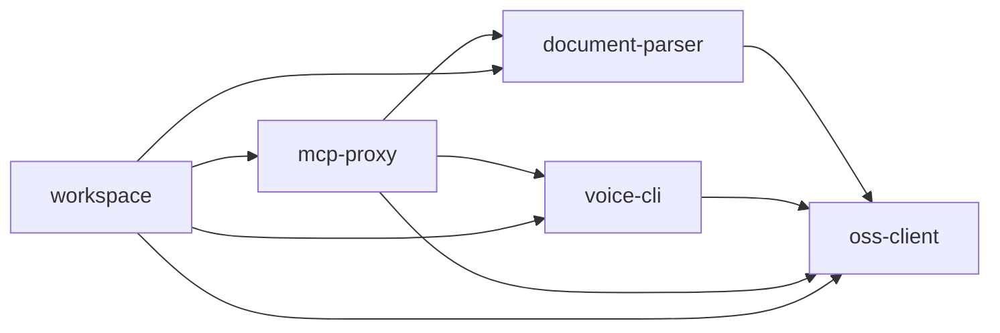

# 项目概述

<cite>
**本文档引用的文件**   
- [README.md](file://README.md)
- [Cargo.toml](file://Cargo.toml)
- [document-parser/README.md](file://document-parser/README.md)
- [mcp-proxy/QUICK_START.md](file://mcp-proxy/QUICK_START.md)
- [voice-cli/README.md](file://voice-cli/README.md)
- [oss-client/README.md](file://oss-client/README.md)
- [document-parser/src/main.rs](file://document-parser/src/main.rs)
- [mcp-proxy/src/main.rs](file://mcp-proxy/src/main.rs)
- [voice-cli/src/main.rs](file://voice-cli/src/main.rs)
- [oss-client/src/lib.rs](file://oss-client/src/lib.rs)
- [document-parser/src/routes.rs](file://document-parser/src/routes.rs)
- [mcp-proxy/src/server/router_layer.rs](file://mcp-proxy/src/server/router_layer.rs)
- [document-parser/src/app_state.rs](file://document-parser/src/app_state.rs)
- [mcp-proxy/src/model/app_state_model.rs](file://mcp-proxy/src/model/app_state_model.rs)
- [voice-cli/src/server/mod.rs](file://voice-cli/src/server/mod.rs)
- [document-parser/src/services/document_service.rs](file://document-parser/src/services/document_service.rs)
- [mcp-proxy/src/server/mcp_dynamic_router_service.rs](file://mcp-proxy/src/server/mcp_dynamic_router_service.rs)
- [oss-client/src/private_client.rs](file://oss-client/src/private_client.rs)
</cite>

## 目录
1. [简介](#简介)
2. [项目结构](#项目结构)
3. [核心组件](#核心组件)
4. [架构概览](#架构概览)
5. [详细组件分析](#详细组件分析)
6. [依赖关系分析](#依赖关系分析)
7. [性能考量](#性能考量)
8. [故障排除指南](#故障排除指南)
9. [结论](#结论)

## 简介
RMCP-PROXY 是一个综合性的解决方案，集成了文档解析、MCP代理、语音处理和OSS客户端四大核心服务。该项目旨在为用户提供一个统一的平台，通过高性能的多格式文档解析、灵活的MCP代理服务、准确的语音转文字功能以及便捷的OSS对象存储操作，满足多样化的业务需求。文档解析服务支持PDF、Word、Excel等多种格式，利用MinerU和MarkItDown双引擎实现高效转换；MCP代理服务支持SSE和Streamable HTTP协议，实现远程MCP功能的代理与协议转换；语音处理服务基于Whisper引擎提供高质量的语音识别能力；OSS客户端则提供了对阿里云对象存储的简洁操作接口。

**Section sources**
- [README.md](file://README.md)

## 项目结构
RMCP-PROXY项目采用Rust工作区（workspace）模式组织，包含多个独立的子项目，每个子项目负责特定的功能模块。这种结构化的设计使得各服务可以独立开发、测试和部署，同时通过共享的依赖和配置保持整体的一致性。项目根目录下的`Cargo.toml`文件定义了整个工作区的成员，包括`document-parser`、`fastembed`、`mcp-proxy`、`oss-client`和`voice-cli`。每个子项目都有自己的`Cargo.toml`文件，管理其特定的依赖关系。`assets`和`scripts`目录分别存放静态资源和管理脚本，`spec`目录包含设计文档，而`fixtures`目录则提供了测试用的示例文件。

**Diagram sources **
- [Cargo.toml](file://Cargo.toml)

**Section sources**
- [Cargo.toml](file://Cargo.toml)

## 核心组件
本项目由四个核心组件构成：文档解析服务、MCP代理服务、语音处理服务和OSS客户端。文档解析服务（document-parser）是一个高性能的多格式文档解析器，支持PDF、Word、Excel等格式，通过MinerU和MarkItDown双引擎实现结构化Markdown输出，并集成了OSS存储功能。MCP代理服务（mcp-proxy）实现了MCP（Model Control Protocol）代理，支持SSE和Streamable HTTP协议，能够动态添加MCP插件并进行协议转换。语音处理服务（voice-cli）基于Rust构建，利用Whisper模型提供语音转文字（STT）功能，支持多种音频格式。OSS客户端（oss-client）则提供了对阿里云OSS的简洁操作接口，支持文件的上传、下载、删除和签名URL生成。

**Section sources**
- [README.md](file://README.md)
- [document-parser/README.md](file://document-parser/README.md)
- [mcp-proxy/QUICK_START.md](file://mcp-proxy/QUICK_START.md)
- [voice-cli/README.md](file://voice-cli/README.md)
- [oss-client/README.md](file://oss-client/README.md)

## 架构概览
RMCP-PROXY的架构设计遵循微服务原则，各组件通过清晰的API接口进行通信。文档解析服务和语音处理服务作为独立的HTTP服务运行，通过RESTful API接收请求。MCP代理服务作为核心枢纽，接收来自客户端的SSE或Streamable HTTP请求，根据配置动态启动或代理后端的MCP服务。OSS客户端作为共享库，被文档解析服务和语音处理服务调用，用于与阿里云OSS进行交互。整个系统通过Rust的异步运行时（tokio）实现高并发处理能力，利用axum框架构建HTTP路由，并通过tracing和OpenTelemetry提供全面的监控和追踪功能。

**Diagram sources **
- [README.md](file://README.md)
- [document-parser/src/main.rs](file://document-parser/src/main.rs)
- [mcp-proxy/src/main.rs](file://mcp-proxy/src/main.rs)
- [voice-cli/src/main.rs](file://voice-cli/src/main.rs)

## 详细组件分析

### 文档解析服务分析
文档解析服务是RMCP-PROXY的核心功能之一，负责将各种格式的文档转换为结构化的Markdown。该服务通过`document-parser`子项目实现，支持PDF、Word、Excel、PowerPoint等格式。其核心是双引擎解析架构，使用MinerU引擎处理PDF文档，利用MarkItDown引擎处理其他格式。服务通过`AppState`管理应用状态，包括配置、数据库连接、文档服务和OSS客户端。`DocumentService`类负责具体的解析逻辑，包括格式检测、文档解析、图片上传和路径替换。服务通过`routes.rs`定义的API路由对外提供服务，支持文件上传、URL解析和任务管理。

#### 对于对象导向组件：

**Diagram sources **
- [document-parser/src/app_state.rs](file://document-parser/src/app_state.rs)
- [document-parser/src/services/document_service.rs](file://document-parser/src/services/document_service.rs)

### MCP代理服务分析
MCP代理服务是RMCP-PROXY的通信枢纽，负责处理MCP协议的代理和转换。该服务通过`mcp-proxy`子项目实现，支持SSE和Streamable HTTP两种协议。其核心是动态路由机制，通过`DynamicRouterService`实现。当客户端请求一个未注册的MCP服务路径时，代理服务会尝试根据请求头中的`x-mcp-json`配置启动相应的MCP服务。服务通过`AppState`管理应用状态，包括配置和地址信息。`get_router`函数构建了整个服务的路由，包括健康检查、MCP服务添加、状态检查和动态代理路由。`mcp_dynamic_router_service.rs`中的`DynamicRouterService`实现了核心的路由逻辑，能够根据请求路径解析出MCP ID，并动态启动或代理后端服务。

#### 对于API/服务组件：

**Diagram sources **
- [mcp-proxy/src/main.rs](file://mcp-proxy/src/main.rs)
- [mcp-proxy/src/server/router_layer.rs](file://mcp-proxy/src/server/router_layer.rs)
- [mcp-proxy/src/server/mcp_dynamic_router_service.rs](file://mcp-proxy/src/server/mcp_dynamic_router_service.rs)

### 语音处理服务分析
语音处理服务是RMCP-PROXY的语音识别模块，负责将音频文件转换为文本。该服务通过`voice-cli`子项目实现，基于Rust构建，使用Whisper模型提供语音转文字（STT）功能。服务支持多种音频格式，如MP3、WAV、FLAC等，并通过`apalis`任务队列实现异步处理。`AppState`管理服务状态，包括配置、模型服务和任务队列。`handle_server_run`函数启动HTTP服务器，监听`/transcribe`等API端点。服务通过`TtsService`处理具体的语音转录任务，并将结果存储在数据库中。此外，服务还提供了模型管理功能，支持模型的下载、列表、验证和删除。

#### 对于复杂逻辑组件：

**Diagram sources **
- [voice-cli/src/main.rs](file://voice-cli/src/main.rs)
- [voice-cli/src/server/mod.rs](file://voice-cli/src/server/mod.rs)

### OSS客户端分析
OSS客户端是RMCP-PROXY的存储模块，提供对阿里云OSS的简洁操作接口。该组件通过`oss-client`子项目实现，定义了`OssClientTrait`公共接口，支持私有和公有Bucket的统一操作。`PrivateOssClient`和`PublicOssClient`分别实现了私有和公有Bucket的客户端，提供了文件上传、下载、删除、存在性检查和签名URL生成等功能。`OssClientTrait`定义了所有客户端共享的方法，如`upload_file`、`download_file`、`delete_file`、`file_exists`和`generate_upload_url`。客户端通过`OssConfig`配置对象管理连接信息，包括访问密钥、端点、Bucket名称等。该组件被文档解析服务和语音处理服务调用，用于存储解析后的文档和转录的文本。

#### 对于对象导向组件：

**Diagram sources **
- [oss-client/src/lib.rs](file://oss-client/src/lib.rs)
- [oss-client/src/private_client.rs](file://oss-client/src/private_client.rs)

## 依赖关系分析
RMCP-PROXY项目的各组件之间存在明确的依赖关系。MCP代理服务作为核心，依赖于文档解析服务和语音处理服务提供的功能。文档解析服务和语音处理服务都依赖于OSS客户端，用于与阿里云OSS进行交互。OSS客户端作为共享库，被其他服务通过Cargo.toml中的路径依赖引入。项目使用`workspace.dependencies`在根`Cargo.toml`中定义了共享的依赖，如`axum`、`tokio`、`tracing`等，确保了版本的一致性。`document-parser`和`mcp-proxy`都依赖于`rmcp`库，用于MCP协议的处理。`voice-cli`依赖于`apalis`和`sqlx`，用于任务队列和数据库操作。

**Diagram sources **
- [Cargo.toml](file://Cargo.toml)

**Section sources**
- [Cargo.toml](file://Cargo.toml)

## 性能考量
RMCP-PROXY项目在设计时充分考虑了性能因素。文档解析服务通过`DualEngineParser`实现了双引擎并行处理，能够根据文档格式自动选择最优的解析引擎。服务使用`tokio`异步运行时和`axum`框架，能够高效处理大量并发请求。`DocumentService`中的`task_queue`使用`TaskQueueService`管理任务队列，支持最大并发数和队列大小的配置，避免系统过载。MCP代理服务通过`DynamicRouterService`实现了高效的动态路由，减少了不必要的服务启动。语音处理服务利用`apalis`任务队列实现异步处理，避免了长时间的语音转录任务阻塞HTTP服务器。OSS客户端通过预签名URL和批量操作优化了文件传输性能。

## 故障排除指南
当遇到问题时，首先应检查相关服务的日志文件。文档解析服务的日志位于`logs/`目录下，MCP代理服务的日志位于`mcp-proxy/logs/`目录下，语音处理服务的日志位于`voice-cli/logs/`目录下。对于文档解析服务，常见问题包括虚拟环境未激活、依赖安装失败和GPU加速不生效，可通过运行`document-parser check`和`document-parser troubleshoot`命令进行诊断。对于MCP代理服务，常见问题包括端口被占用、JSON配置格式错误和协议检测失败，可通过检查`mcp-proxy`的启动日志和使用`curl`命令测试API端点来排查。对于语音处理服务，常见问题包括模型下载失败、内存不足和端口被占用，可通过检查网络连接和调整配置来解决。

**Section sources**
- [document-parser/README.md](file://document-parser/README.md)
- [mcp-proxy/QUICK_START.md](file://mcp-proxy/QUICK_START.md)
- [voice-cli/README.md](file://voice-cli/README.md)

## 结论
RMCP-PROXY项目通过集成文档解析、MCP代理、语音处理和OSS客户端四大核心服务，提供了一个功能强大且灵活的综合解决方案。其模块化的设计使得各组件可以独立开发和部署，同时通过清晰的API接口和共享的依赖保持整体的一致性。项目利用Rust语言的高性能和内存安全特性，结合异步编程模型，能够高效处理大规模的并发请求。无论是需要将文档转换为结构化Markdown，还是需要代理远程MCP服务，或是进行语音转文字处理，RMCP-PROXY都能提供稳定可靠的服务。通过本文档的介绍，用户可以全面了解项目的架构设计、核心功能和使用方法，从而更好地利用这一强大的工具。