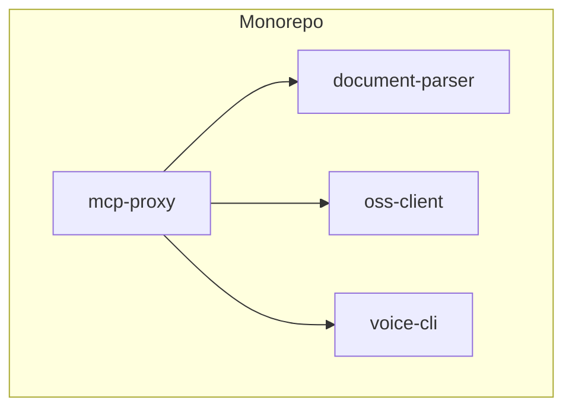
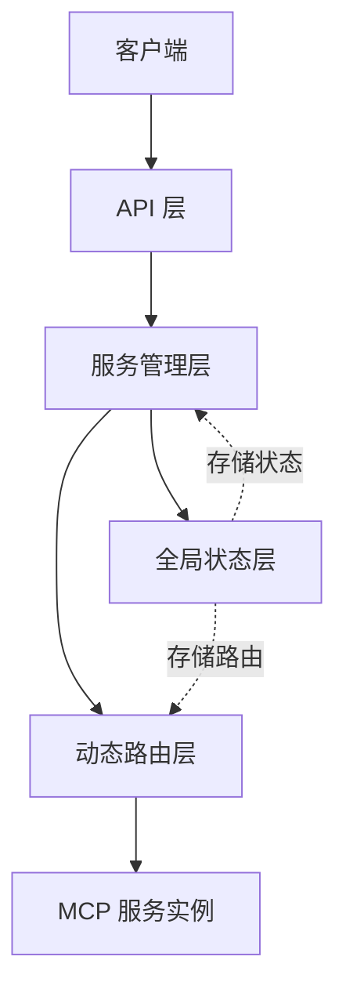
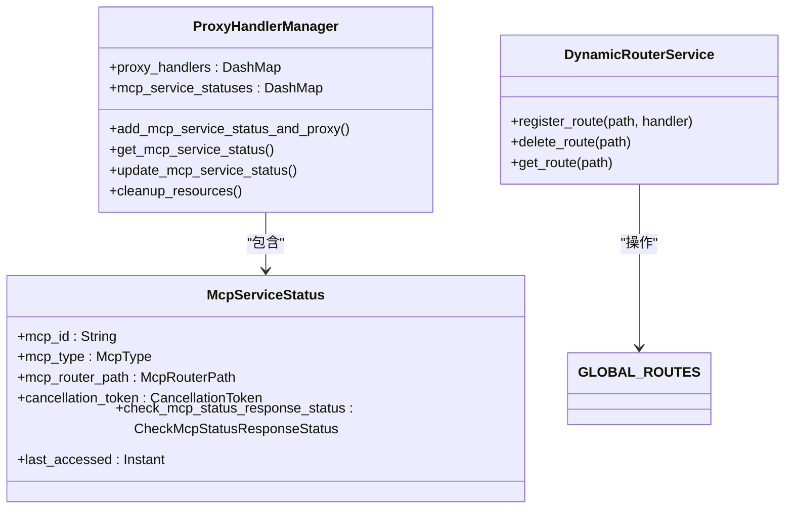
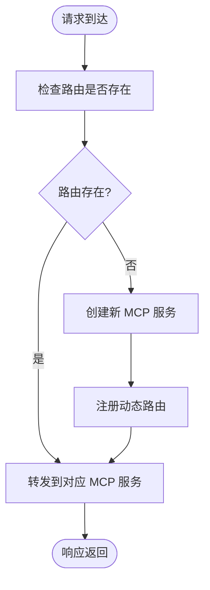
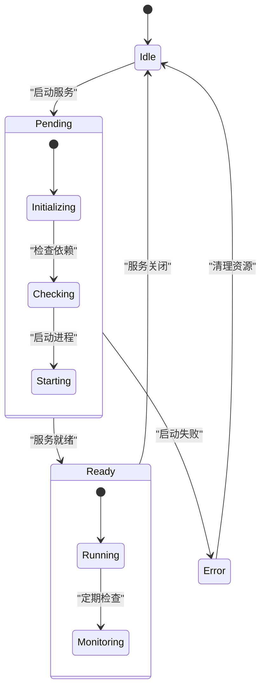
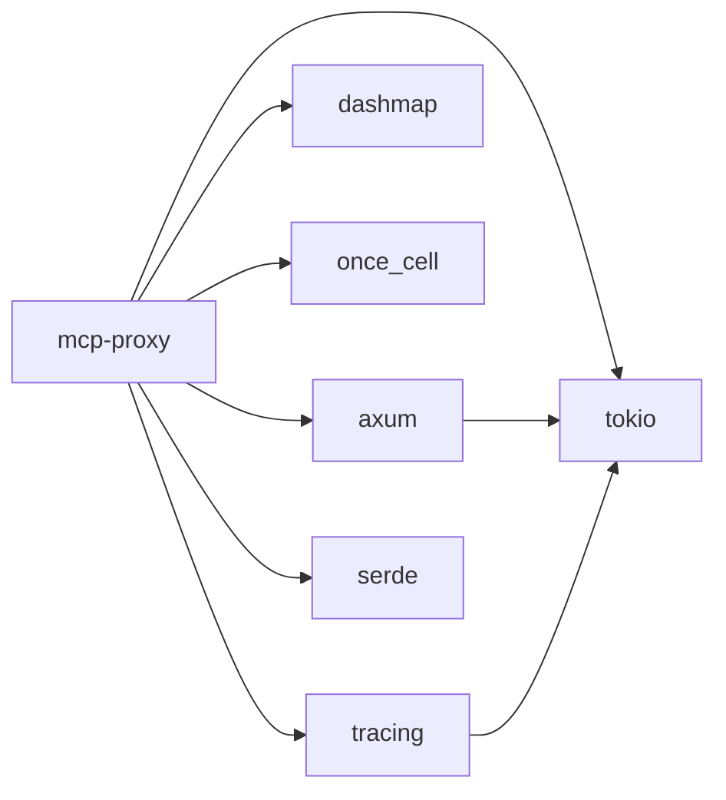

# 项目概述

<cite>
**本文档中引用的文件**  
- [main.rs](file://mcp-proxy/src/main.rs)
- [router_layer.rs](file://mcp-proxy/src/server/router_layer.rs)
- [app_state_model.rs](file://mcp-proxy/src/model/app_state_model.rs)
- [global.rs](file://mcp-proxy/src/model/global.rs)
- [mcp_check_status_handler.rs](file://mcp-proxy/src/server/handlers/mcp_check_status_handler.rs)
- [mcp_start_task.rs](file://mcp-proxy/src/server/task/mcp_start_task.rs)
- [document_parser/README.md](file://document-parser/README.md)
- [voice-cli/README.md](file://voice-cli/README.md)
- [oss-client/README.md](file://oss-client/README.md)
</cite>

## 目录
1. [介绍](#介绍)
2. [项目结构](#项目结构)
3. [核心组件](#核心组件)
4. [架构概述](#架构概述)
5. [详细组件分析](#详细组件分析)
6. [依赖分析](#依赖分析)
7. [性能考虑](#性能考虑)
8. [故障排除指南](#故障排除指南)
9. [结论](#结论)

## 介绍
mcp-proxy 是一个基于 Rust 构建的后端微服务系统，作为 monorepo 的核心代理服务，协调多个子项目（document-parser、oss-client、voice-cli）的运行。该项目主要负责远程代码执行代理、结构化文档生成、语音合成任务调度等关键功能。通过使用 Rust 语言、Axum 框架和 Tokio 异步运行时，mcp-proxy 实现了高性能、高并发和内存安全的服务能力。系统支持 SSE（Server-Sent Events）协议进行实时通信，并采用动态路由机制灵活管理 MCP（Microservice Control Protocol）服务实例。

**Section sources**
- [main.rs](file://mcp-proxy/src/main.rs#L0-L127)
- [document_parser/README.md](file://document-parser/README.md#L0-L56)

## 项目结构
mcp-proxy 项目采用 monorepo 结构，包含多个独立但相互协作的子项目：
- **document-parser**：高性能多格式文档解析服务，支持 PDF、Word、Excel、Markdown 等格式，具备 GPU 加速能力。
- **mcp-proxy**：核心代理服务，负责 MCP 服务的生命周期管理、动态路由、状态检查和实时通信。
- **oss-client**：对象存储客户端，提供与 OSS 服务交互的能力，支持签名 URL 上传等功能。
- **voice-cli**：语音处理命令行工具，支持 TTS（文本转语音）和语音识别功能，可作为独立服务运行。

各子项目通过 Cargo 工作空间统一管理，共享依赖和构建配置。主目录下的 `Cargo.toml` 定义了工作空间成员，确保各子项目能够独立编译和测试。

**Diagram sources**
- [mcp-proxy/Cargo.toml](file://mcp-proxy/Cargo.toml)
- [document-parser/README.md](file://document-parser/README.md#L0-L56)

**Section sources**
- [mcp-proxy/Cargo.toml](file://mcp-proxy/Cargo.toml)
- [document-parser/README.md](file://document-parser/README.md#L0-L56)

## 核心组件
mcp-proxy 的核心组件包括全局状态管理器、动态路由服务、MCP 服务状态管理器和代理处理器。这些组件共同实现了 MCP 服务的动态注册、状态监控和请求代理功能。

**Section sources**
- [global.rs](file://mcp-proxy/src/model/global.rs#L0-L206)
- [router_layer.rs](file://mcp-proxy/src/server/router_layer.rs#L0-L80)

## 架构概述
mcp-proxy 采用分层架构设计，主要包括：
- **API 层**：基于 Axum 框架提供 RESTful API 和 SSE 接口，处理健康检查、服务状态查询、路由注册等请求。
- **服务管理层**：负责 MCP 服务的启动、停止、状态监控和资源清理，通过 `ProxyHandlerManager` 管理全局服务实例。
- **动态路由层**：实现基于 MCP ID 的动态路由，将请求转发到对应的 MCP 服务实例。
- **全局状态层**：使用 `once_cell` 和 `DashMap` 实现线程安全的全局状态管理，存储路由表和服务状态。

**Diagram sources**
- [main.rs](file://mcp-proxy/src/main.rs#L0-L127)
- [router_layer.rs](file://mcp-proxy/src/server/router_layer.rs#L0-L80)

## 详细组件分析

### 全局状态管理分析
mcp-proxy 使用 `once_cell::sync::Lazy` 实现全局单例模式，确保 `ProxyHandlerManager` 和 `GLOBAL_ROUTES` 在整个应用生命周期中唯一存在。`DashMap` 提供高性能的并发哈希映射，支持多线程安全访问。

**Diagram sources**
- [global.rs](file://mcp-proxy/src/model/global.rs#L0-L206)

**Section sources**
- [global.rs](file://mcp-proxy/src/model/global.rs#L0-L206)

### 动态路由机制分析
动态路由服务通过 `DynamicRouterService` 结构体实现，利用 `GLOBAL_ROUTES` 静态哈希表存储路由映射。当新的 MCP 服务启动时，系统会为其分配唯一的路由路径，并注册到全局路由表中。

**Diagram sources**
- [router_layer.rs](file://mcp-proxy/src/server/router_layer.rs#L0-L80)
- [mcp_start_task.rs](file://mcp-proxy/src/server/task/mcp_start_task.rs#L141-L182)

**Section sources**
- [router_layer.rs](file://mcp-proxy/src/server/router_layer.rs#L0-L80)
- [mcp_start_task.rs](file://mcp-proxy/src/server/task/mcp_start_task.rs#L141-L182)

### MCP 服务状态管理分析
MCP 服务状态管理器负责跟踪每个 MCP 服务的生命周期，包括启动、运行、错误和清理状态。通过 `CancellationToken` 实现优雅关闭，确保资源正确释放。

**Diagram sources**
- [mcp_check_status_handler.rs](file://mcp-proxy/src/server/handlers/mcp_check_status_handler.rs#L0-L186)
- [mcp_start_task.rs](file://mcp-proxy/src/server/task/mcp_start_task.rs#L141-L182)

**Section sources**
- [mcp_check_status_handler.rs](file://mcp-proxy/src/server/handlers/mcp_check_status_handler.rs#L0-L186)
- [mcp_start_task.rs](file://mcp-proxy/src/server/task/mcp_start_task.rs#L141-L182)

## 依赖分析
mcp-proxy 项目依赖多个关键 crate：
- **axum**：Web 框架，提供路由、中间件和处理函数。
- **tokio**：异步运行时，支持非阻塞 I/O 和并发编程。
- **dashmap**：高性能并发哈希映射，用于全局状态管理。
- **once_cell**：延迟初始化的全局静态变量。
- **tracing**：结构化日志记录和分布式追踪。
- **serde**：序列化和反序列化支持。

**Diagram sources**
- [mcp-proxy/Cargo.toml](file://mcp-proxy/Cargo.toml)

**Section sources**
- [mcp-proxy/Cargo.toml](file://mcp-proxy/Cargo.toml)

## 性能考虑
mcp-proxy 在设计上充分考虑了性能优化：
- 使用 `DashMap` 替代标准 `HashMap`，提高并发访问性能。
- 通过 `tokio::spawn` 异步启动 MCP 服务，避免阻塞主线程。
- 采用 `CancellationToken` 实现轻量级任务取消，减少资源浪费。
- 利用 `tracing` 进行性能监控和瓶颈分析。

## 故障排除指南
常见问题及解决方案：
- **服务启动失败**：检查 `mcp_json_config` 配置是否正确，确保命令和参数无误。
- **SSE 连接中断**：确认客户端支持 SSE 协议，检查网络连接稳定性。
- **动态路由失效**：验证 MCP ID 是否唯一，确认路由注册是否成功。
- **资源泄漏**：确保在服务关闭时调用 `cleanup_resources`，释放所有资源。

**Section sources**
- [mcp_check_status_handler.rs](file://mcp-proxy/src/server/handlers/mcp_check_status_handler.rs#L0-L186)
- [global.rs](file://mcp-proxy/src/model/global.rs#L0-L206)

## 结论
mcp-proxy 作为一个高性能的微服务代理系统，通过 Rust 的内存安全特性和异步编程模型，实现了稳定可靠的后端服务。其模块化设计和动态路由机制使得系统具有良好的扩展性和灵活性。未来可进一步优化资源管理策略，增强监控能力，提升系统的可观测性。