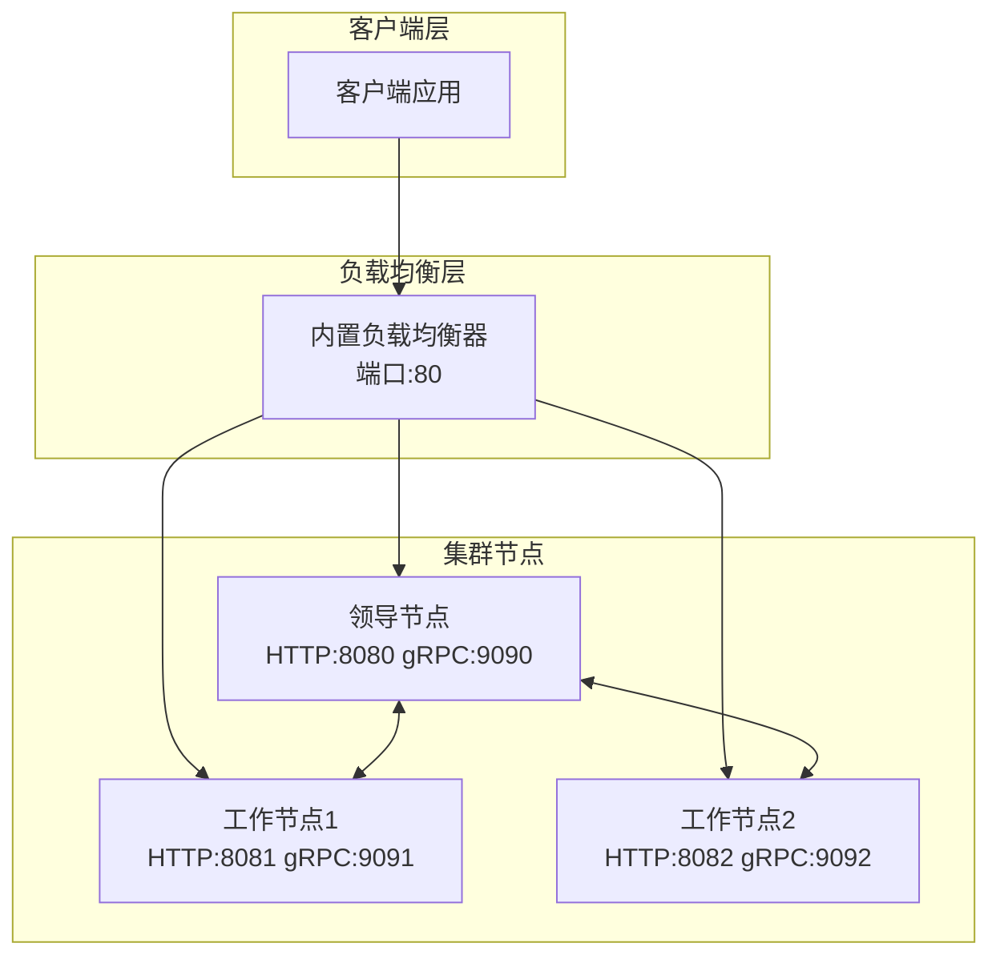

# Voice CLI - 语音转文字集群服务

高性能分布式语音转文字 HTTP 服务，支持单节点和多节点集群部署。基于 Rust 构建，使用 Whisper 引擎提供准确的语音识别能力。

## 🚀 核心特性

### 语音处理能力
- **多格式支持**: MP3, WAV, FLAC, M4A, AAC, OGG 等主流音频格式
- **自动格式转换**: 基于 rs-voice-toolkit 的智能音频处理
- **Whisper 模型**: 支持 tiny/base/small/medium/large 系列模型
- **自动模型管理**: 按需下载和管理 Whisper 模型

### 部署模式
- **🏠 单节点部署**: 快速启动，适合小规模使用
- **🏢 集群部署**: 多节点分布式处理，支持负载均衡和故障转移
- **⚡ 内置负载均衡**: 无需外部组件的集成负载均衡器
- **🔄 热扩容**: 动态添加/移除节点，无服务中断

### 高级功能
- **RESTful API**: 完整的 HTTP API 接口
- **实时监控**: 集群状态、节点健康检查
- **任务调度**: 智能任务分发算法
- **故障恢复**: 自动节点故障检测和任务重分配

## 📋 系统要求

- **操作系统**: Linux/macOS/Windows
- **内存**: 最低 2GB，推荐 8GB+
- **存储**: 至少 5GB（用于模型存储）
- **网络**: 集群部署需要节点间可互相访问

## 🛠️ 快速安装

### 从源码构建
```bash
# 克隆项目
git clone https://github.com/your-org/mcp-proxy
cd mcp-proxy

# 构建 voice-cli
cargo build --release -p voice-cli

# 二进制文件位置
ls target/release/voice-cli
```

## 🏠 单节点部署 (推荐入门)

### 方式一：直接运行（最简单）

```bash
# 1. 切换到工作目录
mkdir -p /opt/voice-service
cd /opt/voice-service
cp /path/to/voice-cli ./

# 2. 启动服务（自动创建配置文件）
./voice-cli server run

# 3. 测试服务
curl -X POST http://localhost:8080/transcribe \
  -F "audio=@test.mp3" \
  -F "model=base"
```

### 方式二：后台运行（使用 nohup）

```bash
# 1. 启动后台服务
nohup ./voice-cli server run > server.log 2>&1 &

# 2. 检查进程状态
ps aux | grep voice-cli

# 3. 停止服务
pkill -f "voice-cli server run"

# 4. 查看日志
tail -f server.log
```

### 方式三：系统服务（推荐生产环境）

```bash
# 1. 安装为系统服务
sudo ./voice-cli cluster install-service --service-name voice-cli

# 2. 启用开机自启
sudo systemctl enable voice-cli

# 3. 启动服务
sudo systemctl start voice-cli

# 4. 查看服务状态
sudo systemctl status voice-cli

# 5. 查看服务日志
sudo journalctl -u voice-cli -f
```

## CLI Commands

### Server Management

```bash
# Run server in foreground
voice-cli server run

# Initialize server configuration
voice-cli server init [--config path] [--force]
```

### 🔧 服务停止机制

我们采用符合行业标准的服务停止方式：

**标准信号处理**：
- 使用 `CancellationToken` 进行优雅关闭
- 支持 `SIGTERM`/`SIGINT` 信号处理
- 通过 `broadcast` 通道协调多任务停止

**停止方式**：
```bash
# ✅ 推荐：发送系统信号
kill -TERM <pid>
kill -INT <pid>  # Ctrl+C

# ✅ 推荐：使用进程管理工具
pkill -f "voice-cli cluster run"
pkill -f "voice-cli lb run"

# ✅ 推荐：对于系统服务
sudo systemctl stop <service-name>
```

### Model Management

```bash
# Download a specific model
voice-cli model download base

# List available and downloaded models
voice-cli model list

# Validate downloaded models
voice-cli model validate

# Remove a downloaded model
voice-cli model remove base
```

## 🏢 集群部署 (生产推荐)

### 架构概览



### 第一步：部署首个节点（领导节点）

```bash
# 服务器 1 (192.168.1.100)
cd /opt/voice-cluster
cp /path/to/voice-cli ./

# 1. 初始化集群环境
./voice-cli cluster init

# 2. 启动集群节点（前台模式用于调试）
./voice-cli cluster run
# 或者后台模式（生产环境推荐）
nohup ./voice-cli cluster run > cluster.log 2>&1 &
# 输出: ✅ Cluster node started as Leader

# 3. 验证节点状态
./voice-cli cluster status

# 4. 测试直接访问
curl -X POST http://192.168.1.100:8080/transcribe \
  -F "audio=@test.mp3" \
  -F "model=base"
```

### 第二步：添加工作节点

```bash
# 服务器 2 (192.168.1.101)
cd /opt/voice-cluster

# 1. 初始化节点环境
./voice-cli cluster init --http-port 8081 --grpc-port 9091

# 2. 加入现有集群 (使用 gRPC 端口)
./voice-cli cluster join 192.168.1.100:9090 \
  --advertise-ip 192.168.1.101 \
  --http-port 8081 --grpc-port 9091

# 3. 启动节点（前台模式用于调试）
./voice-cli cluster run --http-port 8081 --grpc-port 9091

# 或者后台模式（生产环境推荐）
nohup ./voice-cli cluster run --http-port 8081 --grpc-port 9091 > cluster.log 2>&1 &

# 4. 验证加入成功
./voice-cli cluster status
```

### 第三步：部署负载均衡器

```bash
# 在任一服务器或独立服务器上启动负载均衡器（后台模式）
nohup ./voice-cli lb run --port 80 > lb.log 2>&1 &

# 前台运行（开发测试）
./voice-cli lb run --port 80

# 检查进程状态
ps aux | grep "voice-cli lb run"

# 停止
pkill -f "voice-cli lb run"
```

### 第四步：验证集群部署

```bash
# 1. 检查集群整体状态
./voice-cli cluster status

# 2. 查看所有节点端点
# 注意：endpoints 命令已移除，请使用 status 命令查看集群信息

# 3. 测试负载均衡
for i in {1..5}; do
  curl -X POST http://localhost:80/transcribe \
    -F "audio=@test.mp3" \
    -F "model=base"
done
```

## ⚙️ 配置详解

### 基础配置文件 (config.yml)

```yaml
server:
  host: "0.0.0.0"
  port: 8080
  max_file_size: 209715200  # 200MB
  cors_enabled: true

whisper:
  default_model: "base"
  models_dir: "./models"
  auto_download: true
  supported_models: ["tiny", "base", "small", "medium", "large-v3"]

logging:
  level: "info"
  log_dir: "./logs"
  max_file_size: "10MB"
  max_files: 5

daemon:
  pid_file: "./voice-cli.pid"
  log_file: "./logs/daemon.log"
  work_dir: "./"
```

### 集群配置 (cluster-config.yml)

```yaml
cluster:
  node_id: "auto"  # 自动生成
  bind_address: "0.0.0.0"
  http_port: 8080      # HTTP API 端口
  grpc_port: 9090      # 集群通信端口
  leader_can_process_tasks: true  # 领导节点是否处理任务
  heartbeat_interval: 3    # 心跳间隔(秒)
  election_timeout: 15     # 选举超时(秒)
  metadata_db_path: "./data"
  enabled: true

load_balancer:
  enabled: true
  bind_address: "0.0.0.0"
  port: 80
  health_check_interval: 30
  health_check_timeout: 5
  pid_file: "./voice-cli-lb.pid"
  log_file: "./logs/lb.log"
```

## 🔧 CLI 命令参考

### 单节点服务管理

```bash
# 服务器生命周期
voice-cli server run           # 前台运行
voice-cli server init          # 初始化配置

# 模型管理
voice-cli model download base  # 下载模型
voice-cli model list          # 列出模型
voice-cli model validate      # 验证模型
voice-cli model remove base   # 删除模型
voice-cli model diagnose base # 诊断模型

# 系统服务
voice-cli cluster install-service --service-name <name>  # 安装系统服务
sudo systemctl start <service-name>                      # 启动服务
sudo systemctl stop <service-name>                       # 停止服务
sudo systemctl status <service-name>                     # 查看服务状态
```

### 集群管理命令

```bash
# 集群生命周期
voice-cli cluster init [选项]            # 初始化集群环境
voice-cli cluster run [选项]             # 前台运行集群节点（开发/调试）

# 集群操作
voice-cli cluster join <peer-address> --advertise-ip <local-ip> [选项] # 加入集群（必须指定本节点IP）
voice-cli cluster status                 # 集群状态
voice-cli cluster generate-config       # 生成配置文件

# 系统服务管理
voice-cli cluster install-service [选项]  # 安装系统服务
voice-cli cluster uninstall-service <name> # 卸载系统服务
voice-cli cluster service-status <name>   # 查看服务状态

# 示例：前台运行（开发模式）
voice-cli cluster run --http-port 8081 --grpc-port 9091

# 示例：后台运行（生产模式）
nohup voice-cli cluster run --http-port 8081 --grpc-port 9091 > cluster.log 2>&1 &

# 示例：加入现有集群
 voice-cli cluster join  --peer-address 192.168.8.182:50051 --advertise-ip 192.168.8.138  --http-port 8082 --grpc-port 9092
```

### 负载均衡器管理

```bash
# 负载均衡器生命周期
voice-cli lb run [--port 80]            # 前台运行

# 状态查看
ps aux | grep "voice-cli lb run"        # 查看进程状态
```

## 🌐 API 接口

### 转录音频 (POST /transcribe)

**请求示例:**
```bash
curl -X POST http://localhost:8080/transcribe \
  -F "audio=@audio.mp3" \
  -F "model=base" \
  -F "language=zh" \
  -F "response_format=json"
```

**响应示例:**
```json
{
  "text": "这是语音识别的结果文本。",
  "segments": [
    {
      "start": 0.0,
      "end": 2.5,
      "text": "这是语音识别的结果文本。",
      "confidence": 0.95
    }
  ],
  "language": "zh",
  "duration": 2.5,
  "processing_time": 0.8
}
```

### 健康检查 (GET /health)

**单节点响应:**
```json
{
  "status": "healthy",
  "models_loaded": ["base"],
  "uptime": 3600,
  "version": "0.1.0"
}
```

**集群响应:**
```json
{
  "status": "healthy", 
  "role": "leader",
  "cluster_size": 3,
  "node_id": "node-abc123",
  "models_loaded": ["base"],
  "uptime": 3600
}
```

### 模型列表 (GET /models)

```json
{
  "available_models": ["tiny", "base", "small", "medium", "large"],
  "loaded_models": ["base"],
  "model_info": {
    "base": {
      "size": "142 MB", 
      "memory_usage": "388 MB",
      "status": "loaded"
    }
  }
}
```

## 📊 监控和日志

### 日志文件位置

```bash
# 服务日志
./logs/voice-cli.log          # 应用日志
./logs/daemon.log             # 守护进程日志
./logs/lb.log                 # 负载均衡器日志

# 集群日志
./logs/cluster.log            # 集群操作日志
./logs/raft.log              # Raft 共识日志

# 实时查看日志
tail -f ./logs/voice-cli.log
tail -f ./logs/cluster.log
```

### 性能监控

```bash
# 查看集群状态
./voice-cli cluster status

# 查看负载均衡器统计
ps aux | grep "voice-cli lb run"

# 查看系统资源使用
# 注意：health 命令已移除，请使用 status 命令查看集群状态
```

## 🚀 部署场景

### 场景一：开发测试环境

```bash
# 单机快速启动（前台运行）
cd /tmp/voice-test
./voice-cli server run
# 访问: http://localhost:8080
```

### 场景二：小型生产环境

```bash
# 单节点 + 系统服务（后台运行）
./voice-cli cluster install-service --service-name voice-cli
sudo systemctl enable voice-cli
sudo systemctl start voice-cli
```

### 场景三：高可用生产集群

```bash
# 3节点集群 + 负载均衡器
# 节点1: 初始化并启动领导节点（后台模式）
./voice-cli cluster init && nohup ./voice-cli cluster run > cluster.log 2>&1 &

# 节点2,3: 加入集群（后台模式）
./voice-cli cluster join <leader-ip>:9090
nohup ./voice-cli cluster run > cluster.log 2>&1 &

# 独立服务器: 部署负载均衡器  
nohup ./voice-cli lb run --port 80 > lb.log 2>&1 &
```

### 场景四：混合部署（单节点+负载均衡）

```bash
# 服务器上同时运行节点和负载均衡器
nohup ./voice-cli cluster run > cluster.log 2>&1 &  # 端口 8080（后台模式）
nohup ./voice-cli lb run --port 80 > lb.log 2>&1 &  # 端口 80 代理到 8080

# 客户端访问负载均衡器端口
curl http://server:80/transcribe -F "audio=@test.mp3"
```

## 音频格式支持

服务自动检测和转换音频格式：

- **输入格式**: MP3, WAV, FLAC, M4A, AAC, OGG
- **Whisper 格式**: 16kHz, 单声道, 16位 PCM WAV (自动转换)
- **最大文件大小**: 200MB (可配置)

## 模型信息

Whisper 模型自动从官方仓库下载：

| 模型 | 大小 | 语言 | 描述 |
|------|------|------|------|
| tiny | ~39 MB | 英语/多语言 | 最快，准确度最低 |
| base | ~142 MB | 英语/多语言 | 速度和准确度平衡 |
| small | ~244 MB | 英语/多语言 | 更好的准确度 |
| medium | ~769 MB | 英语/多语言 | 高准确度 |
| large | ~1.5 GB | 仅多语言 | 最佳准确度 |

## 依赖组件

- **rs-voice-toolkit**: 音频处理和 STT 能力
- **whisper.cpp**: 底层语音识别引擎
- **Axum**: HTTP 服务器框架
- **Tokio**: 异步运行时
- **Raft**: 集群共识算法
- **Sled**: 嵌入式数据库

## 🔍 故障排除

### 常见问题

**1. 端口占用**
```bash
# 检查端口使用情况
netstat -tlnp | grep :8080
netstat -tlnp | grep :9090

# 使用其他端口
./voice-cli cluster init --http-port 8081 --grpc-port 9091
```

**2. 节点加入失败**
```bash
# 确保使用正确的 gRPC 端口和明确指定本节点IP
./voice-cli cluster join 192.168.1.100:9090 \
  --advertise-ip 192.168.1.101  # ✅ 正确：明确指定本节点IP

# 不要使用： 
# ./voice-cli cluster join 192.168.1.100:80    # ❌ 错误：负载均衡器端口
# ./voice-cli cluster join 192.168.1.100:8080  # ❌ 错误：HTTP端口
# 省略 --advertise-ip 参数              # ❌ 错误：会报错要求明确指定IP
```

**3. 模型下载失败**
```bash
# 手动下载模型
./voice-cli model download base

# 检查网络连接和磁盘空间
df -h ./models/
```

**4. 集群节点失联**
```bash
# 检查网络连通性
ping 192.168.1.100

# 检查防火墙设置
sudo ufw allow 9090/tcp  # gRPC端口
sudo ufw allow 8080/tcp  # HTTP端口
```

### 调试模式

```bash
# 启用详细日志
RUST_LOG=debug ./voice-cli cluster run

# 查看配置
./voice-cli cluster status --verbose

# 检查集群连接
# 注意：health 命令已移除，请使用 status 命令查看集群状态
```

## 🎯 性能优化

### 硬件推荐

| 规模 | CPU | 内存 | 存储 | 网络 |
|------|-----|------|------|------|
| 开发测试 | 2核 | 4GB | 10GB | 100Mbps |
| 小型生产 | 4核 | 8GB | 50GB | 1Gbps |
| 大型集群 | 8核+ | 16GB+ | 100GB+ | 10Gbps |

### 性能调优

```yaml
# config.yml 性能配置
whisper:
  workers:
    transcription_workers: 4      # 增加工作线程
    worker_timeout: 3600          # 工作超时时间
    
cluster:
  heartbeat_interval: 3           # 心跳间隔
  leader_can_process_tasks: true  # 领导节点参与处理
  
server:
  max_file_size: 536870912       # 512MB 最大文件
```

## 📝 版本说明

- **v1.0.x**: 单节点服务，基础功能
- **v2.0.x**: 集群支持，负载均衡，故障转移
- **v2.1.x**: 性能优化，监控增强
- **v2.2.x**: 高可用性，自动扩缩容

## 🤝 贡献

欢迎提交问题和功能请求！请查看 [CONTRIBUTING.md](CONTRIBUTING.md) 了解详情。

## 📄 许可证

本项目是 mcp_proxy 工作空间的一部分，遵循相同的许可证条款。